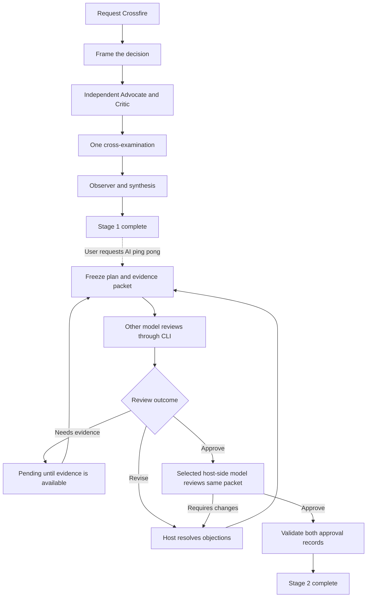

# Agent Skills

A collection of skills for Claude Code and Codex: debate decisions, review plans with two models, maintain a shared domain language, and prepare business-readable release notes.

## Skills in this collection

| Skill | Purpose |
| --- | --- |
| [Crossfire](skills/crossfire/SKILL.md) | Debate a decision through contrasting perspectives and synthesize a recommendation. |
| [AI ping pong](skills/ai-ping-pong/SKILL.md) | Run the separately requested Claude–Codex plan review loop. |
| [Domain Language](skills/domain-language/SKILL.md) | Keep business discussions, the domain glossary, and implementation aligned. |
| [Release Notes](skills/release-notes/SKILL.md) | Build a business-readable HTML digest from merged PRs, with screenshots and a full appendix. Currently configured for Decipher. |
| [Public Release Notes](skills/public-release-notes/SKILL.md) | Publish one formal, customer-facing release note per completed feature to the Decipher Release Notes page, with highlighted element screenshots from a local copy of the app. Runs as a routine; opens PRs, never merges. |

Domain Language and Release Notes are independently usable. The two-stage flow below describes Crossfire and AI ping pong.

## Crossfire and AI ping pong

Different minds. Strong arguments. Common ground.

**Crossfire** brings contrasting perspectives to a decision and tests the arguments behind it. **AI ping pong** is a separate stage: you request it when you want Claude and Codex to review the resulting plan until both approve the same version. Each stage starts with an explicit request.

| Stage | What happens | Where it ends |
| --- | --- | --- |
| **1. Crossfire** | A Strategist frames the decision. An Advocate and Critic assess it separately, cross-examine once, and an Observer audits their reasoning. The host synthesizes a recommendation. | A recommendation, surviving disagreements, and the evidence or next step needed. |
| **2. AI ping pong** | The host sends a complete plan and evidence packet to the other model through its CLI, evaluates objections, and revises the plan. | Both selected models explicitly approve the same packet, or the run remains pending, interrupted, or stopped. |

Crossfire can suggest the second stage. It does **not** start it automatically. AI ping pong can also review a plan created without Crossfire.



The diagram shows Crossfire's Full mode. Quick mode handles simple decisions; Blocked mode identifies missing evidence without staging a debate.

## Install

Crossfire and Domain Language require a Claude Code or Codex host that supports skills. For Crossfire, real isolated subagents are preferred; when they are unavailable, the skill requires disclosure that its perspectives are simulated in one context. Domain Language has no helper runtime or second-provider CLI requirement.

AI ping pong additionally requires:

- Python 3.9 or later; the helper uses only the standard library.
- Both `claude` and `codex` on `PATH`, authenticated through their normal CLI login flows.
- Access to the selected models. The default Claude model requires Claude Code 2.1.280 or later.
- A POSIX environment. Live CLI checks have been run on macOS; native Windows support has not been validated.

Release Notes is the existing Decipher-specific workflow. It requires an authorized Decipher checkout and GitHub access through `gh`, Python 3.9+, and, for screenshots, Node.js, `@playwright/test`, Chrome, and the developer's running frontend with its normal local environment configuration. Cropping uses macOS `sips` or Pillow. Its repository, stage URL, domain terminology, and dev-login flow need adaptation before use with another project.

Clone this repository and register its skill directories:

```sh
(
set -eu
git clone https://github.com/pixel-perfectionist/agent-skills.git
cd agent-skills

mkdir -p "$HOME/.agents/skills" "$HOME/.claude/skills"
for skill_name in crossfire ai-ping-pong domain-language release-notes public-release-notes; do
  for skills_directory in "$HOME/.agents/skills" "$HOME/.claude/skills"; do
    skill_target="$skills_directory/$skill_name"
    if [ -e "$skill_target" ] || [ -L "$skill_target" ]; then
      printf 'Keeping existing skill: %s\n' "$skill_target"
    else
      ln -s "$PWD/skills/$skill_name" "$skill_target"
    fi
  done
done
)
```

Keep the clone at that location while using these links. The commands skip existing skills with the same names; inspect and back up those skills before replacing them. Start a new host session if the skills are not discovered immediately.

For CLI setup, see the [Codex CLI documentation](https://developers.openai.com/codex/cli/) and [Claude Code setup documentation](https://code.claude.com/docs/en/setup).

## Use

Ask Crossfire to review a concrete decision, idea, or plan:

```text
# In Claude Code
/crossfire Should we migrate project metadata from object storage to PostgreSQL?

# In Codex
$crossfire Should we migrate project metadata from object storage to PostgreSQL?
```

Review the synthesis. When you want the second stage, send a new message:

```text
AI ping pong
```

You can also use `/ai-ping-pong` in Claude Code or `$ai-ping-pong` in Codex. The host uses the agreed plan from the conversation, or asks which plan you mean if the target is ambiguous.

The natural-language trigger is handled by the host's skill selection and instructions. This package does not install a shell command or register an event hook.

**This reviews and revises plan text. Approval does not execute the plan or authorize deployment.**

## Domain Language

Keep business conversations and code speaking the same language. The skill can establish a glossary, apply accepted definitions during a feature change, or audit terminology drift. It reuses existing domain sources, distinguishes meanings within their contexts, and retains explicit mappings for public or persisted names that need compatibility.

```text
# In Claude Code
/domain-language Establish a shared glossary from our accepted product requirements.

# In Codex
$domain-language Audit this feature against our domain glossary.
```

When establishing the workflow, it adds concise glossary links to the project's existing agent instructions. Audit requests produce findings without edits. Unresolved business rules remain open questions, and creating a glossary does not imply a repository-wide rename. See the [skill](skills/domain-language/SKILL.md) and [glossary guide with DDD references](skills/domain-language/references/glossary-and-adoption.md).

## Release Notes

Prepare a short release digest for the business and product team, ordered by user impact. The imported skill collects merged PRs for a date range (the last seven days by default), verifies consequential claims, captures stage-data screenshots through the developer's existing local frontend, and bundles a single HTML file with embedded images and a collapsed PR appendix.

```text
# In Claude Code, from a Decipher checkout
/release-notes last week

# In Codex, from a Decipher checkout
$release-notes last week
```

The [procedure](skills/release-notes/SKILL.md), [content guide](skills/release-notes/references/content-guide.md), [research handoff](skills/release-notes/references/agent-prompt.md), template, and scripts retain the existing workflow. The import adds Codex metadata and normalizes description placeholders for skill validation. This is a project-specific profile, not a generic release-notes generator. It includes a paste-ready Teams message.

The source workflow names Claude tools such as Explore agents, Read, and SendUserFile. In Codex, use available isolated subagents, image inspection, and a local file link or attachment for those operations. Codex metadata keeps invocation explicit-only. Runtime adaptation to another project remains separate from this import.

## AI ping pong models and reasoning

| Side | Default model ID | How the review runs |
| --- | --- | --- |
| Claude Opus 5.5 | `claude-opus-5-5` | Claude Code host or `claude -p` |
| GPT-6 Astra | `gpt-6-astra` | Codex host or `codex exec` |

The skill uses your **active reasoning selection** and records its source. It does not infer that selection from a saved global default. If the host cannot read it, it asks once before making model calls.

The bridge passes `low`, `medium`, `high`, `xhigh`, and `max` unchanged. Codex `ultra` maps to Claude `max`, with that mapping disclosed. These names do not imply equivalent computation across providers. Rejected model or effort settings leave the review unapproved; there is no silent fallback.

You can explicitly choose different exact model IDs. A host can approve its own side only when its actual model matches that selection. Otherwise, the host requests that model's review through its CLI too.

## What AI ping pong approval means

Each review receives the full Brief, plan, evidence, unresolved objections, and responses. The helper hashes the entire packet and assigns a fresh request ID. A change to any of those fields invalidates earlier approvals.

A review returns one of three verdicts:

- **`approve`** — no required changes or missing evidence remain in that review.
- **`revise`** — actionable objections need a response.
- **`needs_evidence`** — the reviewer identifies information needed to assess the plan.

The host owns revisions and orchestration; the Python helper performs one CLI review per invocation and validates the final pair of records. CLI workers do not start nested debates. The loop has **no preset round limit**, but a user stop, missing evidence, or an operational failure leaves it unapproved. The default timeout of 900 seconds applies to one CLI call.

The final check requires two explicit approvals for the same packet, distinct request IDs, the selected models and reasoning setting, and at least one CLI review. Artifacts retain the requests, raw responses, invocation metadata, and validated verdicts.

Model identity is reported according to the available evidence: Claude responses must confirm the model through usage metadata; Codex records `requested_only` if runtime model telemetry is absent. A host approval is an agent-authored attestation, not a provider-signed certificate. See the [CLI bridge reference](skills/ai-ping-pong/references/cli-bridge.md) for the full contract.

## Related research

Crossfire and AI ping pong are practical workflows informed by related research, **not reproductions of the cited algorithms**. The studies evaluate different models and tasks. This project has not measured planning-quality improvements for its selected model pair. Domain Language's DDD sources are listed in its [glossary guide](skills/domain-language/references/glossary-and-adoption.md#ddd-foundations).

| Research | Connection to this project | Important distinction |
| --- | --- | --- |
| [Multiagent Debate — Du et al., ICML 2024](https://proceedings.mlr.press/v235/du24e.html) | Independent initial responses followed by peer critique. | Its reasoning and factuality experiments do not establish software-plan correctness. |
| [ReConcile — Chen et al., ACL 2024](https://aclanthology.org/2024.acl-long.381/) | Review across different model providers. | ReConcile also uses confidence-weighted voting; Crossfire does not vote. |
| [Divergent Thinking through Multi-Agent Debate — Liang et al., EMNLP 2024](https://aclanthology.org/2024.emnlp-main.992/) | Opposing perspectives and an assessment of their arguments. | Forced disagreement and additional participants are not consistently beneficial. |
| [Self-Refine — Madaan et al., NeurIPS 2023](https://papers.neurips.cc/paper_files/paper/2023/hash/91edff07232fb1b55a505a9e9f6c0ff3-Abstract-Conference.html) | Actionable feedback followed by revision. | It studies one model refining its output, with bounded iterations. |
| [Reflexion — Shinn et al., NeurIPS 2023](https://papers.neurips.cc/paper_files/paper/2023/hash/1b44b878bb782e6954cd888628510e90-Abstract-Conference.html) | Carrying feedback forward into later attempts. | Many evaluated tasks provide correctness signals that open-ended plans lack. |
| [CRITIC — Gou et al., ICLR 2024](https://proceedings.iclr.cc/paper_files/paper/2024/hash/fef126561bbf9d4467dbb8d27334b8fe-Abstract-Conference.html) | Treating evidence as essential to useful correction. | CRITIC verifies with external tools; our constrained reviewers assess supplied evidence. |
| [LLMs Cannot Self-Correct Reasoning Yet — Huang et al., ICLR 2024](https://proceedings.iclr.cc/paper_files/paper/2024/hash/8b4add8b0aa8749d80a34ca5d941c355-Abstract-Conference.html) | A reason to preserve a missing-evidence outcome. | Its negative findings concern tested settings, not every model or feedback method. |
| [Should we be going MAD? — Smit et al., ICML 2024](https://proceedings.mlr.press/v235/smit24a.html) | A reason to evaluate against simpler review methods. | Debate performance depends on the task, prompts, and configuration. |
| [CONSENSAGENT — Pitre et al., Findings of ACL 2025](https://aclanthology.org/2025.findings-acl.1141/) | A reason to preserve substantive objections and avoid pressure to agree. | Consensus can reflect copying or sycophancy rather than correction. |

The [research notes](docs/research.md) provide full titles, publication links, findings, and the limits of each connection.

## Limits and data flow

Two models approving the same packet means the review condition passed. **It does not establish that the plan is correct.** Separate contexts do not make model errors statistically independent. Models can share a mistaken assumption, overlook a requirement, or persuade each other to accept a flawed plan.

The uncapped loop is a workflow choice, not a result validated by these papers. It can consume substantial time and tokens, and convergence is not guaranteed. Evidence gaps require evidence; repeating a review cannot substitute for it.

AI ping pong sends the packet to the selected providers through your authenticated CLIs. Include only the material needed for the review. Keep private run artifacts outside tracked project files. Reviewer calls use isolated working directories and constrained capabilities; these controls are not a universal security sandbox or a guarantee about all managed platform tools.

## Validation and development

The helper has 33 automated tests covering packet integrity, stale approvals, model and effort records, malformed results, CLI failures, recursion prevention, argument handling, and timeout cleanup.

```sh
PYTHONDONTWRITEBYTECODE=1 python3 -m unittest discover \
  -s skills/ai-ping-pong/scripts -p 'test_cross_review.py'
```

Live checks on macOS used Claude Code 2.1.283 and Codex CLI 0.157.1. Both CLI paths returned approvals for the same small test packet, and the combined validation passed. Those checks verify transport and the approval protocol, not the quality of real-world planning. Compatibility with other CLI versions has not been established; unsupported flags fail visibly.

```text
skills/
  crossfire/
    SKILL.md                 Council procedure and reviewer handoffs
    agents/openai.yaml       Codex discovery metadata
  ai-ping-pong/
    SKILL.md                 Explicitly requested second-stage loop
    agents/openai.yaml       Codex discovery metadata
    references/cli-bridge.md CLI protocol and model-selection rules
    scripts/cross_review.py One-call bridge and approval checker
    scripts/test_cross_review.py
  domain-language/
    SKILL.md                 Establish, apply, or audit shared domain language
    agents/openai.yaml       Codex discovery metadata
    references/glossary-and-adoption.md
  release-notes/
    SKILL.md                 Existing Decipher release-notes workflow
  public-release-notes/
    SKILL.md                 Routine: public release note per completed feature
    references/              Content policy and entry template
    scripts/                 Local app stack and element capture
    agents/openai.yaml       Explicit-only Codex discovery metadata
    assets/template.html    Business-facing HTML page template
    references/agent-prompt.md
    references/content-guide.md
    scripts/build.py         Appendix, image crop, and HTML bundle helpers
    scripts/run.mjs          Playwright screenshot job runner
docs/
  research.md                Annotated research references
```
